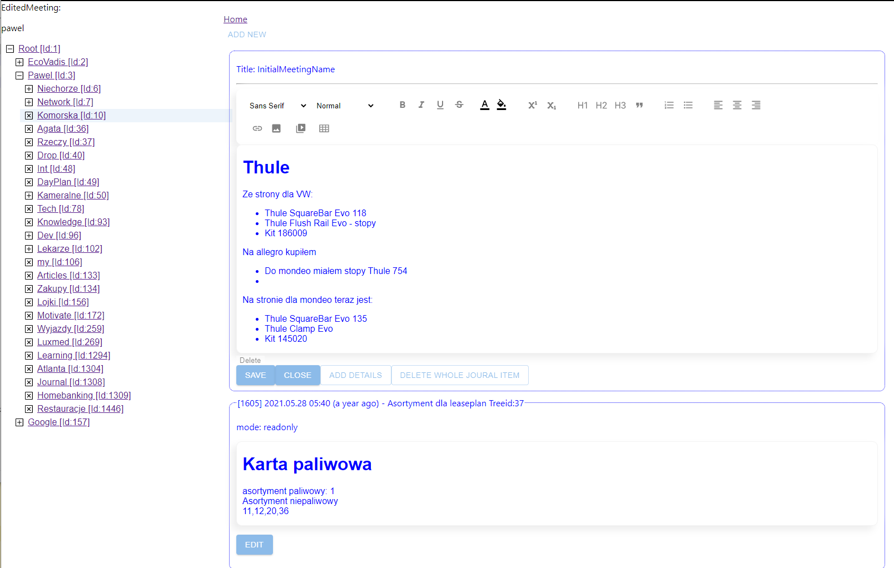

<!--Category:C#,SQL--> 
 

    <a href="http://productivitytools.tech/productivitytools-createsqlserverdatabase/"><a> 
    

    

# Journal Web

Web application which allows to create notes from daily events. The source idea was to create a notes from the meetings. Every meeting could have different parts like before meeting, after meeting during meeting notes

All notes are organized as Facebook wall. The last messages are in the top.

